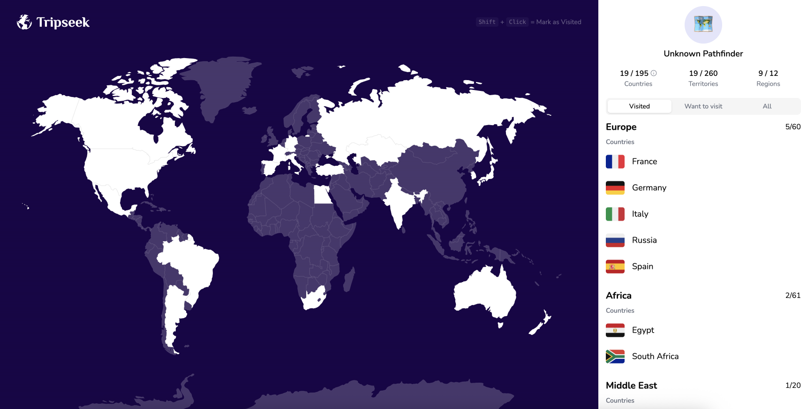

# Tripseek

**Tripseek** is an interactive travel map for marking visited and wishlist countries. It runs fully in the browser — no backend, no login, no external services.

**Live Demo:** [https://tripseek-seven.vercel.app](https://tripseek-seven.vercel.app)



## ✨ Features

- Interactive world map with hover and click feedback
- Mark countries as **visited**
- Add countries to your **wishlist**
- Filter countries by status: All / Visited / Wishlist
- View countries grouped by continent
- Fully responsive layout for mobile and desktop
- Instant feedback — works 100% client-side

## 🧱 Tech Stack

- **React 19** — UI and component logic
- **TypeScript** — static typing
- **Zustand** — lightweight global state management
- **TailwindCSS** — utility-first styling
- **shadcn/ui** — modern, accessible UI components

## 🚀 Getting Started

1. **Clone the repository**
   ```bash
   git clone https://github.com/eugeniy-seliverstov/tripseek.git
   cd tripseek
   ```
2. Install dependencies
   ```bash
   yarn
   ```
3. Start the development server
   ```bash
   yarn dev
   ```

Tripseek will be available at http://localhost:5173 by default.

## 📌 Roadmap

- [x] Wishlist and visited country selection
- [x] Filter by status: All / Visited / Wishlist
- [x] Grouping countries by continent
- [x] Travel statistics in the header
- [x] Country search
- [ ] Editable user profile
- [ ] Public shareable map/profile
- [ ] Improve mobile UX and interactions
- [ ] Build a dedicated mobile app

## 📄 License

The source code is provided for educational and demonstration purposes only.
Commercial or production use is not permitted without explicit permission.

## 🙋‍♂️ Author

Created by [Eugeniy Seliverstov](https://github.com/eugeniy-seliverstov).
Feel free to reach out or open an issue if you have feedback!
